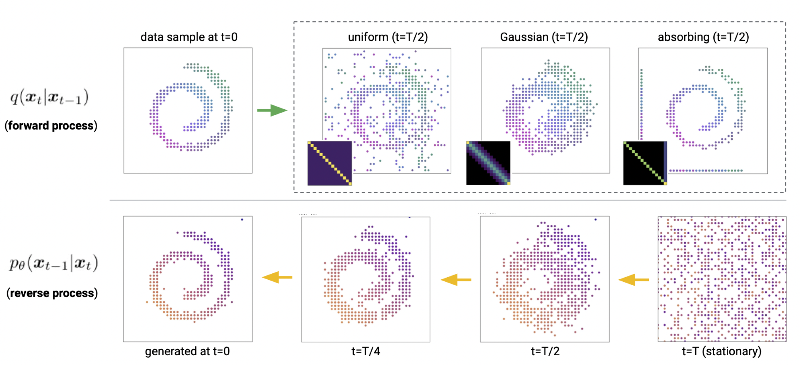
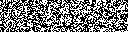
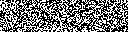

# Minimal Implementation of a D3PM with PaddlePaddle

## Structured Denoising Diffusion Models in Discrete State-Spaces
Jacob Austin, Daniel D. Johnson, Jonathan Ho, Daniel Tarlow & Rianne van den Berg
### Abstract:
Denoising diffusion probabilistic models (DDPMs) have shown impressive results on image and waveform generation in continuous state spaces. Here, we introduce Discrete Denoising Diffusion Probabilistic Models (D3PMs), diffusionlike generative models for discrete data that generalize the multinomial diffusion model of Hoogeboom et al., by going beyond corruption processes with uniform transition probabilities. This includes corruption with transition matrices that mimic Gaussian kernels in continuous space, matrices based on nearest neighbors in embedding space, and matrices that introduce absorbing states. The third allows us to draw a connection between diffusion models and autoregressive and mask-based generative models. We show that the choice of transition matrix is an important design decision that leads to improved results in image and text domains. We also introduce a new loss function that combines the variational lower bound with an auxiliary cross entropy loss. For text, this model class achieves strong results on character-level text generation while scaling to large vocabularies on LM1B. On the image dataset CIFAR-10, our models approach the sample quality and exceed the log-likelihood of the continuous-space DDPM model.

    

## Install

    pip install paddlepaddle-gpu pillow tqdm numpy

## Usage

    python d3pm.py

- This repo is highly referenced from [Minimal Implementation with PyTorch](https://github.com/cloneofsimo/d3pm)

## Sample Results

    
    

## References
- [D3PM Paper: Structured Denoising Diffusion Models in Discrete State-Spaces](https://arxiv.org/abs/2107.03006)
- [Official implementation with JAX](https://github.com/google-research/google-research/tree/master/d3pm)
- [Minimal Implementation with PyTorch](https://github.com/cloneofsimo/d3pm)
- [Notes on D3PM by Christopher Beckham](https://beckham.nz/2022/07/11/d3pms.html)
